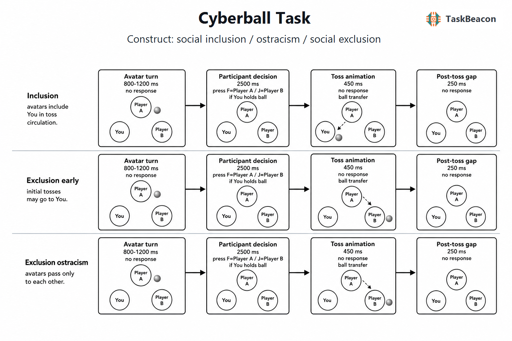

# Cyberball 社会排斥范式：实验逻辑、神经认知证据与测量边界

社会排斥涉及个体被群体成员忽视或拒绝，其即时影响通常表现为归属感、自尊、控制感与存在意义受损。然而，现实排斥事件难以随机分配，事件强度、关系历史与排斥者意图也难以控制。Cyberball（虚拟传球任务）通过操纵虚拟同伴向参与者传球的比例，在保持互动场景、视觉刺激和基本动作要求相近的条件下建立社会纳入与排斥对比，因而成为研究短时排斥反应的主要实验范式。该范式的核心价值在于对社会参与机会进行可重复操纵，并将主观需要威胁、行为应对及神经反应联系到同一段互动历程；其结果所反映的仍是受控情境中的即时反应，不能直接等同于长期孤独、真实关系破裂或临床功能损害。

## 1. 范式提出与理论背景

Cyberball 源于对“网络排斥”（cyberostracism）的实验研究。Williams、Cheung 与 Choi（2000）采用在线传球游戏发现，即使互动对象遥远、关系短暂，低传球参与仍会降低归属感、自尊、控制感和存在意义。后续程序化版本允许研究者设定玩家数、传球序列和参与比例，使这一操作能够在实验室、网络与神经影像环境中复用（Williams & Jarvis, 2006）。研究还表明，即使参与者被明确告知同伴由计算机控制，排斥仍可引起需要受威胁，说明反应并不完全依赖对真实同伴的确信（Zadro et al., 2004）。

时间性需要威胁模型（temporal need-threat model）将排斥反应区分为反射、反思与退避阶段。短暂排斥首先引起负性情绪和四类基本需要受损，随后个体依据情境评估采取重新联结、恢复控制或回避等反应；长期、反复排斥才可能进入无助与退避状态（Williams, 2009）。Cyberball 最适合识别前两个阶段，尤其是排斥发生后的即时需要威胁。即使排斥带来经济收益、纳入伴随经济损失，参与者仍报告显著的不适与需要受损，支持社会参与具有超出即时工具性收益的价值（van Beest & Williams, 2006）。这一结果并不意味着排斥反应不受情境调节，而是说明传球机会本身具有较强的社会信号作用。

## 2. 任务逻辑、流程与核心参数

经典 Cyberball 通常包含一名真实参与者和两名预编程虚拟玩家。参与者持球时在两个同伴之间选择接球者；虚拟玩家持球时，程序按照预设概率或序列决定下一位持球者。纳入条件下，三人的接球机会大致均等；排斥条件通常先给予参与者少量传球，随后虚拟玩家只在彼此之间传递。常见实现采用约 30 次传球，纳入条件中参与者获得约三分之一传球，排斥条件中仅在开端接球两次，但总传球数、玩家决策延迟及条件呈现方式并非跨研究固定标准（Williams & Jarvis, 2006; Hartgerink et al., 2015）。

一次传球事件可分为持球者等待、目标选择、传球动画和下一事件间隔。参与者的目标选择反映其对同伴的趋近、报复或公平反应，但排斥阶段参与者持球机会减少，导致选择次数与反应时的可比性随条件而改变。Cyberball 的主要因变量因此通常是区组后的需要威胁量表、负性情绪、被忽视感与接球比例估计，而不是简单的按键正确率。传球比例是操纵变量；“排斥 > 纳入”的主观差异同时包含低社会参与、低事件概率和对公平轮转预期的违背。若研究目标是区分这些过程，应独立操纵客观接球概率与事先形成的接球预期，而不能将所有差异概括为排斥特异反应（Weschke & Niedeggen, 2015）。

经典程序并无依据参与者表现实时调整难度的自适应阶梯。研究者可采用固定传球序列、按条件设定传球概率，或在交替设计中改变纳入与排斥片段长度。固定序列有利于跨参与者保持事件数一致，概率策略则保留互动的不确定性，但会增加个体实际接球数的变异。神经影像和 EEG 研究还需区分“球传给自己”“球传给他人”以及条件转换事件；只比较整段排斥与纳入，会把事件构成差异、运动反应缺失和持续情绪状态合并在同一对比中。

## 3. 主要行为与神经科学发现

### 3.1 即时需要威胁、预期与行为反应

对 120 项 Cyberball 研究的元分析显示，排斥相对于纳入会显著降低四类基本需要满足和情绪水平，说明该操作具有稳定的群体操纵效应；效应量同时呈现很高的研究间异质性，任务版本、样本、测量时点与操纵强度均可能改变结果（Hartgerink et al., 2015）。因此，Cyberball 适合检验平均意义上的即时排斥效应，但同一操作所得分数并非天然适合作为稳定人格指标或临床筛查工具。

行为反应也受到参与预期的制约。低接球概率只有在违背预期时才更强地威胁基本需要，提示参与者判断的是当前互动相对于预期公平性的偏离，而非机械累计未接球次数（Weschke & Niedeggen, 2015）。Groth 与 Rief（2022）先以排斥建立负性社会预期，再给予持续排斥或意外纳入；意外纳入提高了特定及一般化社会预期，表明该范式可用于研究正向预期违背。该结果来自非临床样本，尚不足以证明相同操作能够改变抑郁障碍患者的持久关系信念。

自评并未覆盖排斥反应的全部表现。Mulder 等（2023）在大样本儿童中对愤怒、悲伤和轻蔑面部表情进行微编码，发现观察指标与自报负性体验对后续问题行为的关联并不一致。Cyberball 研究若关注个体差异，宜结合即时自评、行为选择和观察或生理指标，并预先说明哪个指标对应需要威胁、预期更新或应对行为。

### 3.2 fMRI 与 EEG 所揭示的加工过程

早期功能磁共振成像（functional magnetic resonance imaging, fMRI）研究报告，排斥相对于纳入伴随背侧前扣带皮层、前岛叶和右腹侧前额叶活动变化，其中前扣带活动与自报社会痛苦相关（Eisenberger et al., 2003）。这一结果推动了“社会痛与躯体痛共享神经表征”的解释，但单项血氧水平依赖（blood-oxygen-level-dependent, BOLD）研究只能说明条件相关活动，无法证明某一区域对主观痛苦具有排斥特异或因果作用。

后续累积证据削弱了对背侧前扣带皮层的强特异性解释。早期定量综述未发现社会拒绝与躯体伤害在所谓“疼痛矩阵”上的稳定重合（Cacioppo et al., 2013）。针对 53 项 Cyberball fMRI 研究的激活似然估计元分析发现，排斥较一致地涉及腹侧前扣带、后扣带、额下回、额上回、后岛叶和枕极，却未观察到可靠的背侧前扣带聚合；共同活动模式更接近参与自我相关思考、心理化和情境解释的默认网络（Mwilambwe-Tshilobo & Spreng, 2021）。2024 年采用动脉自旋标记的重复研究再现了额下回和腹侧扣带反应，但这些区域在被动观看条件中也有活动，进一步表明其功能不能归结为单一“社会痛”过程（Labek & Viviani, 2024）。

发展研究说明年龄会调节排斥相关网络的参与方式。青少年与成人在 Cyberball 排斥中均可表现出心理化和情绪调节相关活动，但年龄组在内侧前额叶等区域的条件效应不同（Sebastian et al., 2011）。这类横断面差异支持社会评价加工在发展期发生变化，不能据此推断单个青少年的成熟程度或未来精神病理风险。

脑电图（electroencephalography, EEG）与事件相关电位（event-related potential, ERP）提供了传球事件后的毫秒级时间信息。研究曾将中央—顶叶 P3/P3b 幅度变化解释为排斥警报；在独立操纵接球概率与主观预期后，P3b 更符合对意外事件的情境更新，而不是排斥特异神经反应（Weschke & Niedeggen, 2015）。近期系统综述认为，多数 Cyberball ERP 成分的来源尚不明确，P3 复合波最一致的解释是预期违背，且任务呈现位置、事件概率和条件切换均会影响波幅（Vanhollebeke et al., 2023）。EEG 证据由此限定了时间进程，却不能仅凭头皮分布确定产生信号的脑区。

## 4. 范式发展与主要应用

Cyberball 已从单次区组设计扩展到纳入—排斥交替、过度纳入、观察他人受排斥及预期确认/违背等版本。交替设计增加了可用于事件相关分析的条件转换次数，也可能强化参与者对规律的觉察；过度纳入和正向预期违背则把研究问题从排斥损伤拓展到社会参与程度与预期更新（Groth & Rief, 2022）。这些版本测量的对比不同，不能因共享传球界面而视为同一构念的可互换指标。

在发展与临床研究中，Cyberball 提供了标准化的短时社会压力诱发方式。青少年研究可考察同伴评价敏感性及调节网络的发展变化（Sebastian et al., 2011）；焦虑、抑郁、自闭症谱系和边缘型人格障碍研究则常比较群体平均需要威胁或神经反应。此类差异可用于检验机制假设，不能单独支持个体诊断。面向纵向与干预研究，一项 30 名青少年的研究显示，排斥后需要威胁分数在一个月内具有可接受的排序稳定性和内部一致性，但复测时绝对痛苦水平下降（Davidson et al., 2019）。这一初步结果支持重复测量的可行性，同时受小样本和熟悉化影响限制。

## 5. 测量效度与解释边界

Cyberball 的优势是操纵简洁、平均效应强且易于跨环境实施。其构念效度主要来自接球比例对被忽视感、负性情绪与四类需要威胁的系统影响，而不是来自任何单一神经指标。群体效应很强并不保证个体差异可靠；行为元分析中的显著异质性和复测衰减均要求研究者针对具体样本报告操纵检验、量表信度及实际接球次数（Hartgerink et al., 2015; Davidson et al., 2019）。

主要混淆来自社会意义与统计规律的重合。排斥条件同时减少自我相关事件、按键机会与控制体验，并增加稀有事件和预期违背。固定采用“纳入后排斥”的顺序还会混入时间、疲劳和顺序效应。可信度亦不等同于效度：计算机同伴仍能引起需要威胁（Zadro et al., 2004），但虚拟、短时且目标单一的互动对现实关系排斥的生态外推有限。严谨设计应依据研究问题选择区组或事件相关分析，独立记录实际传球序列，并将主观需要威胁、事件预期和神经信号分别解释。

## 6. TaskBeacon 中的任务实现

### 6.1 任务资源与访问入口

| 资源 | ID | 用途 | 地址 |
|---|---|---|---|
| TaskBeacon 行为实验实现 | T000034 | PsychoPy/PsyFlow 完整本地实验 | https://github.com/TaskBeacon/T000034-cyberball |
| TaskBeacon 浏览器预览源码 | H000034 | 与 T000034 流程对齐的 HTML 行为预览 | https://github.com/TaskBeacon/H000034-cyberball |
| 浏览器运行入口 | H000034 | 在线体验，不替代受控本地采集 | https://taskbeacon.github.io/psyflow-web/?task=H000034-cyberball |

### 6.2 实现流程与关键参数

TaskBeacon 当前版本为英文行为任务，采用固定顺序的纳入和排斥两个区组，每区组 30 次传球。每个区组从左侧虚拟玩家持球开始。纳入条件中，虚拟玩家每次以 0.33 概率把球传给参与者；排斥条件先让参与者累计接球两次，随后虚拟玩家只传给另一名虚拟玩家。该控制方式依据区组内接球计数改变后续传球策略，属于有状态的条件策略，不是依据参与者表现调整难度的自适应阶梯。

**图 1. TaskBeacon Cyberball 的区组与传球事件流程。** 每个区组先载入 `inclusion` 或 `exclusion` 条件并重置接球计数，随后连续执行 30 次传球。虚拟玩家持球时等待 0.8–1.2 秒，再按条件策略确定接球者；参与者持球时在 2.5 秒内按 F 选择左侧玩家或按 J 选择右侧玩家，超时则在左右玩家间随机选择。目标确定后呈现 0.45 秒传球动画和 0.25 秒事件间隔。纳入条件的虚拟玩家以 0.33 概率传给参与者；排斥条件在参与者接球两次后仅在两名虚拟玩家间传递。任务不提供正确/错误或金钱反馈，区组结束仅汇总参与者接球与传球次数。

当前实现逐次记录传球前后持球者、参与者是否接球、选择键、反应时和超时状态。屏幕状态栏同时显示条件名称及当前传球编号，因此纳入—排斥差异包含传球行为与显式条件标签的共同影响。主要分析宜优先采用实际接球比例、区组后需要威胁或情绪评分；当前任务文件未包含区组后需要威胁量表，若研究目标涉及主观排斥体验，需要另行配置相应测量。现有仓库文件也无法确认参与者是否相信虚拟玩家为真人，或该信念是否接受操纵检验。

## 参考文献

Cacioppo, S., Frum, C., Asp, E., Weiss, R. M., Lewis, J. W., & Cacioppo, J. T. (2013). A quantitative meta-analysis of functional imaging studies of social rejection. *Scientific Reports, 3*, 2027. https://doi.org/10.1038/srep02027

Davidson, C. A., Willner, C. J., van Noordt, S. J. R., Banz, B. C., Wu, J., Kenney, J. G., Johannesen, J. K., & Crowley, M. J. (2019). One-month stability of Cyberball post-exclusion ostracism distress in adolescents. *Journal of Psychopathology and Behavioral Assessment, 41*(3), 400–408. https://doi.org/10.1007/s10862-019-09723-4

Eisenberger, N. I., Lieberman, M. D., & Williams, K. D. (2003). Does rejection hurt? An fMRI study of social exclusion. *Science, 302*(5643), 290–292. https://doi.org/10.1126/science.1089134

Groth, R.-M., & Rief, W. (2022). Response to unexpected social inclusion: A study using the Cyberball paradigm. *Frontiers in Psychiatry, 13*, 911950. https://doi.org/10.3389/fpsyt.2022.911950

Hartgerink, C. H. J., van Beest, I., Wicherts, J. M., & Williams, K. D. (2015). The ordinal effects of ostracism: A meta-analysis of 120 Cyberball studies. *PLOS ONE, 10*(5), e0127002. https://doi.org/10.1371/journal.pone.0127002

Labek, K., & Viviani, R. (2024). Reassessing the neural correlates of social exclusion: A replication study of the Cyberball paradigm using arterial spin labeling. *Brain Sciences, 14*(11), 1158. https://doi.org/10.3390/brainsci14111158

Mulder, R. H., Bakermans-Kranenburg, M. J., Veenstra, J., Tiemeier, H., & van IJzendoorn, M. H. (2023). Facing ostracism: Micro-coding facial expressions in the Cyberball social exclusion paradigm. *BMC Psychology, 11*(1), 185. https://doi.org/10.1186/s40359-023-01219-x

Mwilambwe-Tshilobo, L., & Spreng, R. N. (2021). Social exclusion reliably engages the default network: A meta-analysis of Cyberball. *NeuroImage, 227*, 117666. https://doi.org/10.1016/j.neuroimage.2020.117666

Sebastian, C. L., Tan, G. C. Y., Roiser, J. P., Viding, E., Dumontheil, I., & Blakemore, S.-J. (2011). Developmental influences on the neural bases of responses to social rejection: Implications of social neuroscience for education. *NeuroImage, 57*(3), 686–694. https://doi.org/10.1016/j.neuroimage.2010.09.063

van Beest, I., & Williams, K. D. (2006). When inclusion costs and ostracism pays, ostracism still hurts. *Journal of Personality and Social Psychology, 91*(5), 918–928. https://doi.org/10.1037/0022-3514.91.5.918

Vanhollebeke, G., Aers, F., Goethals, L., De Raedt, R., Baeken, C., van Mierlo, P., & Vanderhasselt, M.-A. (2023). Uncovering the underlying factors of ERP changes in the Cyberball paradigm: A systematic review investigating the impact of ostracism and paradigm characteristics. *Neuroscience & Biobehavioral Reviews, 155*, 105464. https://doi.org/10.1016/j.neubiorev.2023.105464

Weschke, S., & Niedeggen, M. (2015). ERP effects and perceived exclusion in the Cyberball paradigm: Correlates of expectancy violation? *Brain Research, 1624*, 265–274. https://doi.org/10.1016/j.brainres.2015.07.038

Williams, K. D. (2009). Ostracism: A temporal need-threat model. *Advances in Experimental Social Psychology, 41*, 275–314. https://doi.org/10.1016/S0065-2601(08)00406-1

Williams, K. D., Cheung, C. K. T., & Choi, W. (2000). Cyberostracism: Effects of being ignored over the Internet. *Journal of Personality and Social Psychology, 79*(5), 748–762. https://doi.org/10.1037/0022-3514.79.5.748

Williams, K. D., & Jarvis, B. (2006). Cyberball: A program for use in research on interpersonal ostracism and acceptance. *Behavior Research Methods, 38*(1), 174–180. https://doi.org/10.3758/BF03192765

Zadro, L., Williams, K. D., & Richardson, R. (2004). How low can you go? Ostracism by a computer is sufficient to lower self-reported levels of belonging, control, self-esteem, and meaningful existence. *Journal of Experimental Social Psychology, 40*(4), 560–567. https://doi.org/10.1016/j.jesp.2003.11.006
